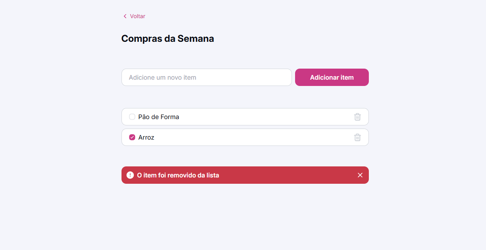

# Quicklist

Projeto desenvolvido durante o evento da Rocketseat para criar uma lista de compras interativa.

## 📋 O que faz

Uma lista de compras simples onde você pode:

- Adicionar itens à lista
- Marcar itens como concluídos
- Remover itens da lista
- Ver mensagem de confirmação ao remover

## 🛠️ Tecnologias

- **HTML5** - Estrutura da página
- **CSS3** - Estilos e design responsivo
- **JavaScript** - Interatividade e manipulação da lista

## 🚀 Como usar

1. Digite um item no campo de texto
2. Clique em "Adicionar item" ou pressione Enter
3. Marque o checkbox para habilitar a remoção
4. Clique na lixeira para remover o item

## 📂 Estrutura

```
Quicklist/
├── index.html          # Página principal
├── scripts/index.js    # Lógica JavaScript
├── styles/            # Arquivos CSS
└── assets/            # Imagens e ícones
```

---

Feito com ❤️ durante o evento da Rocketseat
